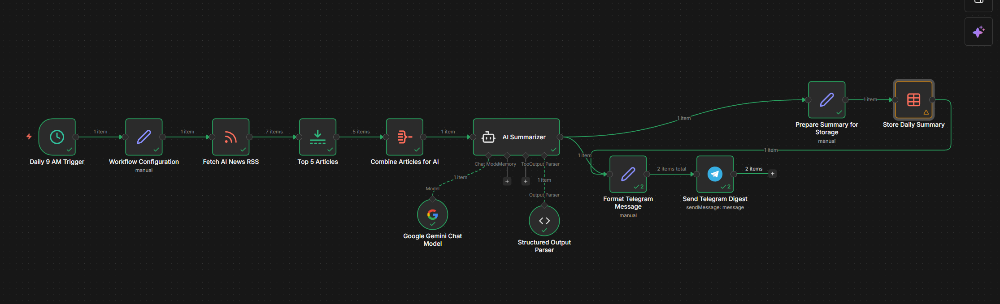

# 📰 Daily AI News Summarizer

An automated AI-powered news digest built with n8n.

## 🚀 What It Does

Every day at 9 AM the workflow:

1. Fetches latest AI news from RSS feeds
2. Selects the top 5 articles
3. Uses Google Gemini to summarize them
4. Formats a Telegram-ready digest
5. Sends the summary via Telegram Bot
6. Stores the daily summary in a database

---

## 🏗 Architecture

RSS Feed → n8n → Gemini AI → Telegram Bot → Database Storage



---

## 🛠 Tech Stack

- n8n (workflow automation)
- Google Gemini (AI summarization)
- Telegram Bot API
- RSS Feeds
- Database (for summary storage)

## 📲 Example Telegram Output

Here’s how the daily digest looks in Telegram:


---

## ⚙️ Setup Instructions

### 1️⃣ Clone Repository

```bash
git clone https://github.com/yassinemh3/daily-ai-news-summarizer.git
```
### 2️⃣ Import Workflow into n8n

- Open n8n

- Import workflow/n8n-workflow.json

### 3️⃣ Configure Credentials

You must configure:

- Google Gemini API Key

- Telegram Bot Token

- RSS feed URLs

- Database connection

## 🤖 Telegram Setup

- Create bot via @BotFather

- Copy Bot Token

- Add bot to your chat

- Get your chat ID

- Add credentials in n8n

## 📦 Features

- Automated daily scheduling

- AI-powered summarization

- Structured output parsing

- Markdown Telegram formatting

- Database archival

- Modular and extensible
